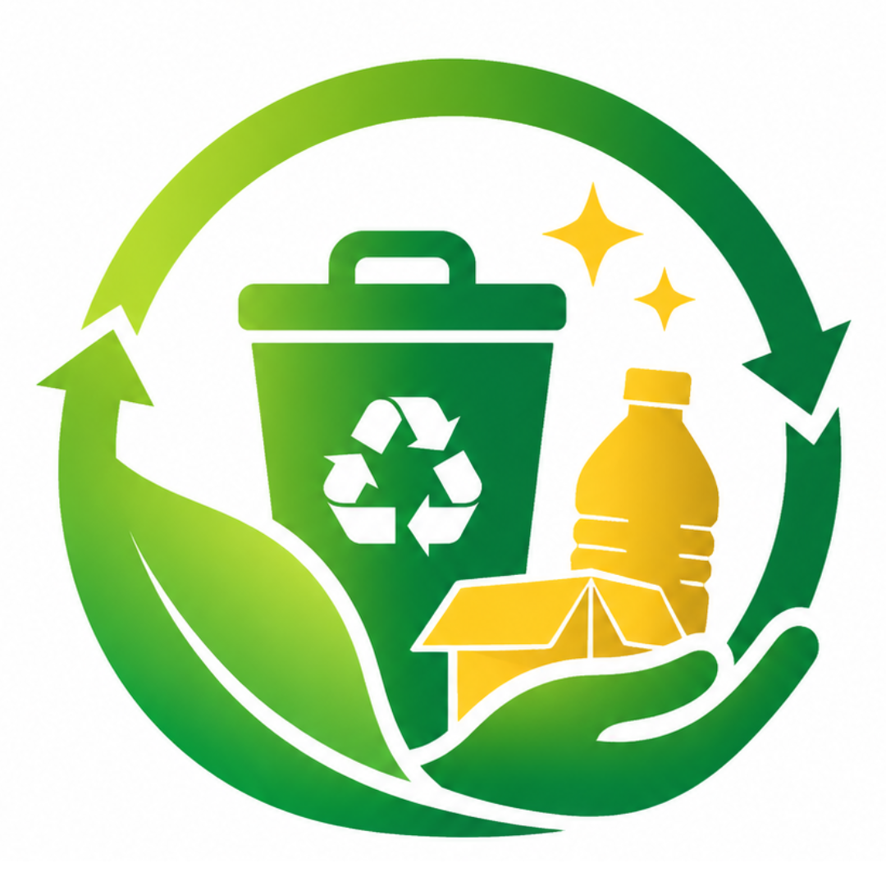
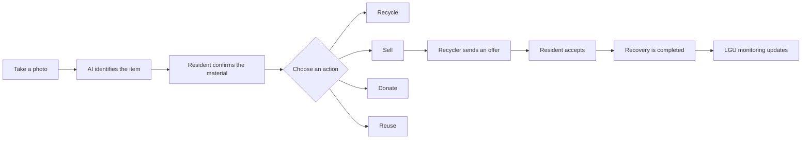
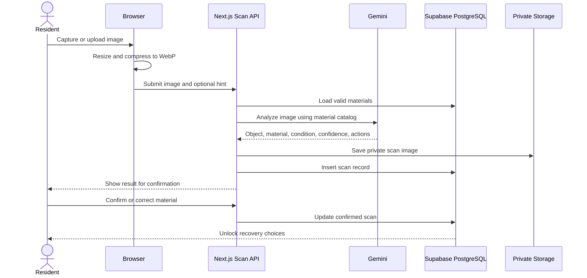
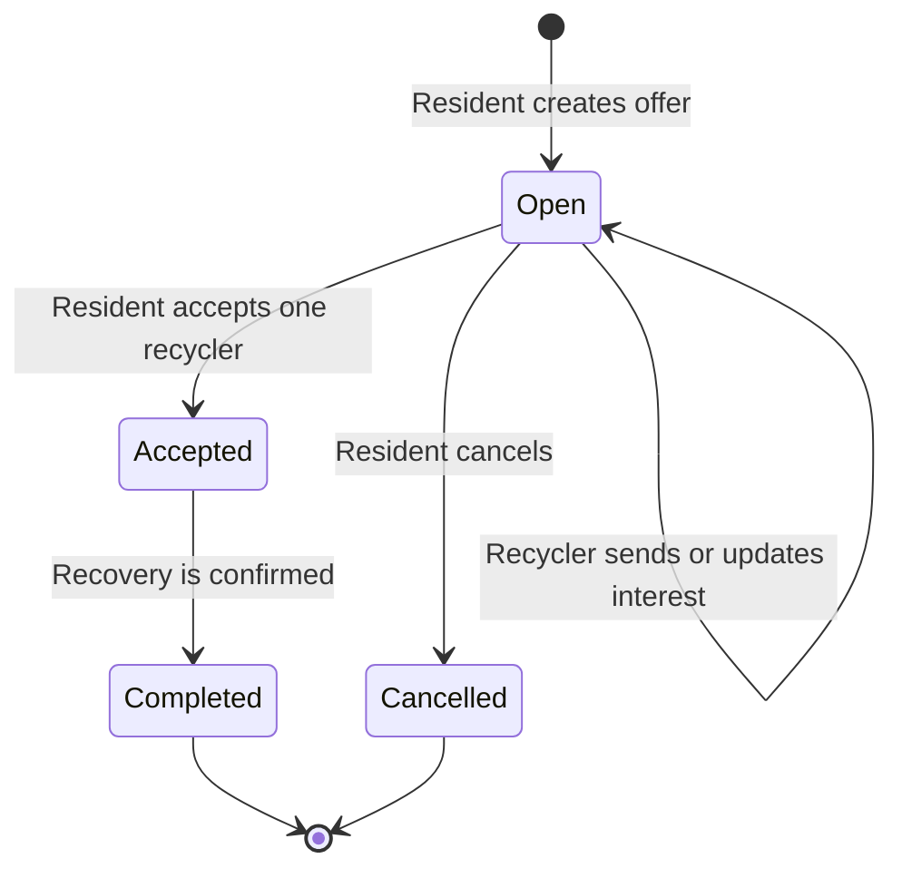
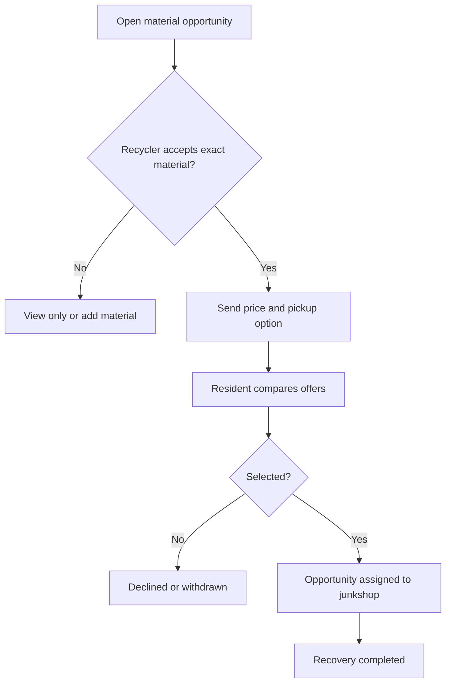

<!--
  Trashure README
  Replace the repository and deployment links when they become available.
-->

<div align="center">




### AI-powered waste identification, recovery, and city monitoring


<br/>


</div>

---

## Table of Contents

- [About Trashure](#about-trashure)
- [The Problem](#the-problem)
- [The Solution](#the-solution)
- [Core Principles](#core-principles)
- [User Roles](#user-roles)
- [Feature Overview](#feature-overview)
- [System Workflows](#system-workflows)
- [Technology Stack](#technology-stack)
- [Project Structure](#project-structure)
- [Main Routes](#main-routes)
- [Database Overview](#database-overview)
- [AI Scanner Architecture](#ai-scanner-architecture)
- [Recovery and Offer System](#recovery-and-offer-system)
- [LGU Monitoring](#lgu-monitoring)
- [Security and Privacy](#security-and-privacy)
- [Responsive Design and Animations](#responsive-design-and-animations)
- [Getting Started](#getting-started)
- [Environment Variables](#environment-variables)
- [Supabase Setup](#supabase-setup)
- [Running the Project](#running-the-project)
- [Testing Checklist](#testing-checklist)
- [Troubleshooting](#troubleshooting)
- [Roadmap](#roadmap)
- [Contributing](#contributing)
- [License](#license)

---

# About Trashure

**Trashure** is an AI-powered waste recovery platform that helps people understand what they can do with recyclable materials they already have.

A resident takes a photo of an item. Trashure identifies the likely material, asks the resident to confirm it, and then gives four practical choices:

<div align="center">

| ♻️ Recycle | 💰 Sell | 🎁 Donate | 💡 Reuse |
|:---:|:---:|:---:|:---:|
| Learn proper preparation and find accepting junkshops | Post the material and receive recycler offers | Find active school or community drives | Explore practical reuse ideas |

</div>

Trashure connects four parts of the local recovery system:

```text
Residents → Recyclers and Junkshops → Schools and Organizations → LGU Monitoring
```

The platform does not treat AI output as the final truth. AI helps identify and rank choices, while the database controls real materials, prices, partners, projects, and completed recovery records.

---

# The Problem

Many households already have recyclable materials such as:

- Plastic bottles
- Cans
- Scrap metal
- Glass containers
- Cardboard and paper
- Old chargers and electronic items
- Reusable household materials

However, people often do not know:

- What material the item is made of
- Whether it can still be recycled or reused
- Which junkshop accepts it
- Where they can sell it
- How much it may be worth per kilogram
- Whether a school or community project needs it
- How to prepare it correctly before recovery

Because this information is scattered or unavailable, recyclable materials are commonly stored at home, mixed with regular garbage, burned, dumped, or sent to landfills.

Junkshops also face the opposite problem. They need recyclable materials but may not know which nearby households currently have them.

Schools and community organizations may run collection drives, but residents may never learn about those programs.

LGUs need reliable records showing how many kilograms or tons were actually recovered, which barangays participated, and which materials contributed the most.

---

# The Solution

Trashure turns the question:

> **“What should I do with this item?”**

into a clear and measurable recovery process.



Trashure transforms unwanted materials into:

- A possible source of income
- A donation to a school or community project
- A reusable resource
- A correctly recycled material
- A measurable contribution to a cleaner city

---

# Core Principles

## 1. AI assists, people confirm

Gemini analyzes the image and suggests a material. The resident must confirm or correct the result before recovery actions are unlocked.

## 2. The database decides what is real

Trashure does not allow AI to invent:

- Junkshops
- Material prices
- Accepted materials
- School drives
- Recovery locations
- Completed transactions

These are loaded from verified database records.

## 3. Exact material matching

A recycler receives an opportunity when the resident material matches the recycler's configured material record.

Material categories may help discovery, but actual offers require an exact material match.

## 4. Monitoring counts completed recovery

A scan does not automatically count as recovered waste.

LGU totals are based on:

- Completed resident recovery opportunities
- Recorded school collection entries

## 5. Privacy by design

Resident scan images are stored privately. Access is limited to the owner and authorized recovery partners through protected routes and database policies.

---

# User Roles

Trashure supports four account roles.

| Role | Main Purpose | Core Access |
|---|---|---|
| `resident` | Identify and recover household materials | Scanner, confirmation, action pages, offers, history |
| `recycler_partner` | Find materials and send recovery offers | Junkshop profile, accepted materials, opportunities, offers |
| `school_partner` | Organize collection programs | Drives, accepted materials, collection records, pickups |
| `lgu_admin` | Monitor city recovery results | Read-only recovery dashboard and analytics |

---

# Feature Overview

## Resident Features

### AI Material Scanner

- Camera capture and photo upload
- Browser-side image compression
- WebP conversion
- Optional item hint
- Gemini image analysis
- Existing-material matching
- Confidence score
- Material condition
- Hazard detection
- Preparation instructions
- Manual correction
- Required user confirmation

### Four Recovery Choices

After confirmation, the resident can open:

- **Recycle**
  - Preparation guide
  - Handling instructions
  - Accepting junkshops

- **Sell**
  - Matching junkshops
  - Price per kilogram
  - Minimum weight
  - Estimated value
  - Resident material offers

- **Donate**
  - Active school drives
  - Exact material matching
  - Verified partner organizations

- **Reuse**
  - Practical item ideas
  - Category-based fallback ideas
  - Disabled when an item is hazardous

### Resident Offers

Residents can:

- Create an offer from a confirmed scan
- Add an estimated weight
- Choose pickup, drop-off, or either
- Review recycler responses
- Compare offered prices
- Accept one recycler
- Cancel an open offer
- Mark a recovery as completed
- View offer history

### Scan History

- Table-based layout
- Search
- Filters
- Pagination
- Configurable rows per page
- Confidence sorting
- Confirmed and hazardous filters
- Scan detail dialog
- Direct links to recovery actions

---

## Recycler Features

### Junkshop Profile

- Junkshop identity and location
- Verification status
- Active or inactive state
- Contact information
- Material listings

### Accepted Materials

Each recycler material record can contain:

- Material
- Price per kilogram
- Minimum weight
- Accepted condition
- Preparation instructions
- Active acceptance status

### Recovery Opportunities

- Database-driven material matching
- Open resident opportunities
- Same-barangay, same-city, and same-province indicators
- Search and filters
- Sorting by:
  - Best match
  - Newest
  - Highest estimated value
  - Heaviest
- Offer creation and update
- Pickup availability
- Offer withdrawal
- Accepted recovery list
- Completed recovery history

### Recycler Offer Safety

Server-side database functions validate:

- Authenticated recycler role
- Approved and active junkshop
- Open opportunity status
- Exact accepted material
- Valid price
- Pickup requirements
- One response per junkshop and opportunity

---

## School Partner Features

### Organization Profile

- School or organization name
- Organization type
- Description
- Address and location
- Contact details
- Verification status

### Collection Drives

- Drive title and description
- Start and end dates
- Target weight
- Collection location
- Accepted materials
- Draft, active, completed, or cancelled status

### Collection Entries

Schools can record:

- Material
- Source
- Weight in kilograms
- Notes
- Photo
- Collection date

### Pickup Coordination

- Pickup requests
- Preferred date and time
- Collection address
- Notes
- Recycler responses
- Selected junkshop
- Request status

---

## LGU Administrator Features

The LGU dashboard is monitoring-only.

It includes:

- Total recovered kilograms and tons
- Resident recovery total
- School collection total
- Open and accepted recovery pipeline
- Registered residents
- Active junkshops
- Verified school partners
- Active collection drives
- Monthly recovery trend
- Top recovered materials
- Barangay rankings
- Recycler performance
- School partner performance
- Recent completed activity
- Weight-quality disclosure

The dashboard scope is based on the LGU administrator's city and province profile fields.

---

# System Workflows

## AI Scanner Workflow



## Resident Offer Workflow



## Recycler Response Workflow



---

# Technology Stack

| Layer | Technology | Purpose |
|---|---|---|
| Framework | Next.js 15 App Router | Routing, layouts, pages, route handlers |
| Language | TypeScript | Strong typing and safer development |
| UI | React | Component-based interface |
| Styling | Tailwind CSS | Responsive design and utility styling |
| Components | Shadcn UI with Base UI | Accessible interface components |
| Icons | Lucide React | Consistent icon system |
| Notifications | Sonner | Toast feedback |
| Database | Supabase PostgreSQL | Relational data and RPC functions |
| Authentication | Supabase Auth | Role-based accounts |
| Storage | Supabase Storage | Private resident scan images |
| Security | Row Level Security | Per-user and per-role access control |
| AI | Google Gemini API | Image and material analysis |
| Deployment | Vercel-compatible | Next.js deployment workflow |

Official references:

- [Next.js App Router documentation](https://nextjs.org/docs/app)
- [Supabase documentation](https://supabase.com/docs)
- [Supabase Auth with Next.js](https://supabase.com/docs/guides/auth/quickstarts/nextjs)
- [Gemini API documentation](https://ai.google.dev/gemini-api/docs)

---

# Project Structure

The exact repository may contain additional components, SQL files, and utilities, but the primary structure follows this pattern:

```text
trashure/
├── app/
│   ├── api/
│   │   ├── opportunities/
│   │   │   └── [id]/
│   │   │       └── image/
│   │   │           └── route.ts
│   │   └── resident/
│   │       ├── opportunities/
│   │       │   └── [id]/
│   │       │       └── accept/
│   │       │           └── route.ts
│   │       └── scan/
│   │           ├── route.ts
│   │           └── [id]/
│   │               └── route.ts
│   │
│   ├── profiles/
│   │   ├── resident/
│   │   │   ├── actions/
│   │   │   │   ├── recycle/
│   │   │   │   ├── sell/
│   │   │   │   ├── donate/
│   │   │   │   └── reuse/
│   │   │   ├── history/
│   │   │   ├── offers/
│   │   │   └── scan/
│   │   │
│   │   ├── recycler/
│   │   │   ├── materials/
│   │   │   └── opportunities/
│   │   │
│   │   ├── school/
│   │   │   ├── drives/
│   │   │   ├── collections/
│   │   │   └── pickups/
│   │   │
│   │   └── lgu/
│   │       ├── layout.tsx
│   │       ├── loading.tsx
│   │       └── page.tsx
│   │
│   ├── login/
│   └── layout.tsx
│
├── components/
│   └── ui/
│
├── lib/
│   ├── gemini/
│   └── supabase/
│       ├── client.ts
│       ├── server.ts
│       └── route.ts
│
├── public/
│   └── logo.png
│
├── supabase/
│   ├── migrations/
│   ├── policies/
│   └── functions/
│
├── .env.local
├── next.config.ts
├── package.json
├── tsconfig.json
└── README.md
```

> Dynamic route folders must use the real bracket format, such as `[id]`. Do not create folders named `%5Bid%5D`.

---

# Main Routes

## Resident

```text
/profiles/resident
/profiles/resident/scan
/profiles/resident/history
/profiles/resident/offers
/profiles/resident/actions/recycle
/profiles/resident/actions/sell
/profiles/resident/actions/donate
/profiles/resident/actions/reuse
```

## Recycler

```text
/profiles/recycler
/profiles/recycler/materials
/profiles/recycler/opportunities
```

## School Partner

```text
/profiles/school
/profiles/school/drives
/profiles/school/collections
/profiles/school/pickups
```

## LGU Administrator

```text
/profiles/lgu
```

All resident routes should remain under:

```ts
const RESIDENT_BASE_PATH = "/profiles/resident";
```

---

# Database Overview

## Identity and Profiles

### `profiles`

Stores the application profile connected to Supabase Auth.

Important fields:

```text
id
auth_id
full_name
email
avatar_url
role
barangay
city
province
onboarding_completed
created_at
updated_at
```

Supported roles:

```text
resident
school_partner
recycler_partner
lgu_admin
```

---

## Material Catalog

### `materials`

The official material list used by AI matching and recovery features.

```text
id
material_name
category
```

Gemini must match a material from this table or return no match.

---

## AI Scans

### `scans`

Stores AI analysis and resident confirmation.

Important fields:

```text
id
user_id
image_url
image_storage_path
detected_object
object_description
material_id
material_type
material_category
condition
confidence_score
primary_action
recommended_action
preparation_steps
hazardous
hazard_notes
needs_user_confirmation
user_confirmed
correction_material_id
ai_raw_result
model_name
analysis_status
barangay
created_at
updated_at
```

---

## Recycler and Junkshop Tables

### `junkshops`

```text
id
profile_id
junkshop_name
photo_url
barangay
city
province
contact_number
verification_status
is_active
created_at
updated_at
```

### `junkshop_materials`

```text
id
junkshop_id
material_id
price_per_kg
minimum_weight_kg
accepted_condition
preparation_instructions
is_accepting
created_at
updated_at
```

A junkshop should have only one listing per material.

```sql
unique (junkshop_id, material_id)
```

---

## Resident Opportunity Tables

### `material_opportunities`

```text
id
resident_profile_id
material_id
scan_id
image_url
estimated_weight_kg
actual_weight_kg
material_condition
fulfillment_method
barangay
city
province
status
selected_junkshop_id
completed_at
created_at
updated_at
```

Supported fulfillment methods:

```text
drop_off
pickup
either
```

Supported statuses:

```text
open
accepted
completed
cancelled
```

### `opportunity_responses`

```text
id
opportunity_id
junkshop_id
offered_price_per_kg
pickup_available
message
status
created_at
updated_at
```

Supported response statuses:

```text
interested
accepted
declined
withdrawn
```

---

## School Partner Tables

### `school_partners`

Stores verified schools, nonprofit organizations, and community partners.

### `school_drives`

Stores collection campaigns and target weights.

### `school_drive_materials`

Links drives to accepted materials.

### `school_collection_entries`

Stores recorded collection weights.

### `school_pickup_requests`

Stores school pickup requests.

### `school_pickup_responses`

Stores recycler responses to pickup requests.

---

# AI Scanner Architecture

Trashure uses Gemini for image understanding, not for controlling business records.

## Scanner Pipeline

```text
Resident photo
→ Browser compression
→ WebP image
→ Authenticated scan API
→ Material catalog loaded from Supabase
→ Gemini image analysis
→ Existing material UUID match
→ Private image storage
→ Scan record
→ Resident confirmation
→ Database-driven action choices
```

## Confidence Levels

Suggested interface behavior:

| Confidence | Meaning | Action |
|---|---|---|
| `80%` or higher | Likely match | Still show confirmation |
| `60%–79%` | Uncertain | Strong confirmation prompt |
| Below `60%` | Weak match | Retake or manually select |

## Important AI Rules

- Never expose the Gemini API key to the browser
- Do not use a `NEXT_PUBLIC_` Gemini key
- Require user confirmation
- Allow manual correction
- Match only existing `materials.id` values
- Store raw analysis for debugging when appropriate
- Block unsafe reuse suggestions for hazardous items

---

# Recovery and Offer System

## Database-Driven Actions

### Recycle

Available as a guide after material confirmation.

The page may show:

- Preparation steps
- Accepted conditions
- Approved junkshops
- Safety instructions

### Sell

Available when an approved, active junkshop:

- Accepts the exact material
- Has `is_accepting = true`
- Has a valid price greater than zero

### Donate

Available when:

- A verified partner is active
- A drive is active and within its date range
- `school_drive_materials` contains the exact material

### Reuse

Available for nonhazardous materials.

Ideas can come from:

- AI-generated item ideas
- Material-category fallbacks
- Verified safety guidance

---

## Important RPC Functions

Depending on the migration set installed in the project, Trashure uses functions such as:

```text
accept_opportunity_response(...)
get_recycler_opportunity_dashboard()
upsert_recycler_opportunity_response(...)
withdraw_recycler_opportunity_response(...)
get_lgu_monitoring_dashboard(...)
```

RPC functions should:

- Resolve the authenticated profile internally
- Validate the user's role
- Validate ownership
- Lock records during important status changes
- Check the current opportunity status
- Prevent duplicate responses
- Return structured JSON
- Use `security definer` only with a controlled `search_path`
- Grant execution only to appropriate authenticated users

After creating or replacing RPC functions, reload the PostgREST schema cache:

```sql
notify pgrst, 'reload schema';
```

---

# LGU Monitoring

The LGU dashboard is intentionally read-only.

## Recovered Tonnage Formula

The LGU total combines:

```text
Completed resident recovery weight
+
Recorded school collection weight
```

For resident opportunities:

```sql
coalesce(actual_weight_kg, estimated_weight_kg)
```

For school collections:

```text
school_collection_entries.weight_kg
```

## Data Quality

School collection weights are recorded values.

Resident opportunity weight may be:

- Actual, when `actual_weight_kg` is present
- Estimated, when only `estimated_weight_kg` is available

The dashboard should disclose this difference rather than presenting estimates as perfect measurements.

## Monitoring Scope

The LGU RPC restricts results to the authenticated administrator's:

```text
city
province
```

Initial implementation may be used for Isabela City, while the same design can support other LGUs by updating profile scope data.

---

# Security and Privacy

## Authentication

Supabase Auth handles user sessions.

Every protected page should verify:

1. A user is authenticated
2. A matching `profiles` row exists
3. The profile role is allowed
4. The user owns or is authorized to view the requested record

## Row Level Security

Enable RLS on user and operational tables.

Policies should prevent:

- Residents from reading other residents' private scans
- Recyclers from editing resident opportunities
- Schools from viewing unrelated private records
- LGUs from editing operational transactions
- Browser clients from using service-role privileges

## Private Scan Images

Recommended bucket:

```text
resident-scans
```

The bucket should be private.

Serve images through a protected route:

```text
/api/opportunities/[id]/image
```

The route may allow:

- The resident owner
- An approved recycler with a valid material match while the opportunity is open
- The selected recycler after acceptance
- Authorized server-side access

## Secret Keys

Server-only keys must never appear in:

- Client components
- Browser bundles
- Public Git history
- Screenshots
- README examples containing real values

---

# Responsive Design and Animations

Trashure uses a mobile-first interface with solid white cards, green borders, zinc text, and rounded components.

## Responsive Behavior

- Mobile navigation drawers
- Sticky headers
- Horizontally scrollable tables where necessary
- Single-column cards on small screens
- Multi-column layouts on larger screens
- `minmax(0, 1fr)` for flexible grid content
- `min-w-0` to stop text from expanding cards
- Image fallbacks for protected or missing photos
- Responsive dialogs using dynamic viewport height

## Application Animations

Common animation patterns include:

```css
@keyframes trashureFadeUp {
  from {
    opacity: 0;
    transform: translateY(8px);
  }

  to {
    opacity: 1;
    transform: translateY(0);
  }
}

@keyframes scanFadeUp {
  from {
    opacity: 0;
    transform: translateY(9px);
  }

  to {
    opacity: 1;
    transform: translateY(0);
  }
}

@keyframes scanPulse {
  0%,
  100% {
    transform: scale(1);
    opacity: 0.72;
  }

  50% {
    transform: scale(1.04);
    opacity: 1;
  }
}
```

Examples of animation use:

- Page sections fade upward
- Cards lift slightly on hover
- Scanner indicators pulse during analysis
- Refresh icons rotate while loading
- Mobile drawers slide into view
- Skeleton cards appear during data loading
- Status changes use toast notifications

## Reduced Motion Support

Respect the user's operating-system preference:

```css
@media (prefers-reduced-motion: reduce) {
  .scan-motion {
    animation: none !important;
    transition-duration: 0.01ms !important;
  }
}
```

## README Animations

This README uses:

- An animated waving SVG header
- A typing-text SVG banner
- Live technology badges

These animations are visual only and do not affect the application.

---

# Getting Started

## Prerequisites

Install:

- Node.js 20 LTS or newer
- npm, pnpm, yarn, or Bun
- A Supabase project
- A Google Gemini API key
- Git

## Clone the Repository

```bash
git clone <your-repository-url>
cd trashure
```

## Install Dependencies

Using npm:

```bash
npm install
```

Using pnpm:

```bash
pnpm install
```

## Create the Environment File

```bash
cp .env.example .env.local
```

On Windows PowerShell:

```powershell
Copy-Item .env.example .env.local
```

---

# Environment Variables

Create `.env.local` in the project root.

```env
# Public Supabase client configuration
NEXT_PUBLIC_SUPABASE_URL=https://YOUR_PROJECT.supabase.co
NEXT_PUBLIC_SUPABASE_PUBLISHABLE_KEY=YOUR_PUBLISHABLE_KEY

# Use this only when the existing client still expects an anon key
# NEXT_PUBLIC_SUPABASE_ANON_KEY=YOUR_ANON_KEY

# Server-only Supabase access
SUPABASE_SECRET_KEY=YOUR_SERVER_SECRET_KEY

# Older projects may use the service-role variable name
# SUPABASE_SERVICE_ROLE_KEY=YOUR_SERVICE_ROLE_KEY

# Server-only Gemini configuration
GEMINI_API_KEY=YOUR_GEMINI_API_KEY
GEMINI_MODEL=gemini-3.1-flash-lite

# Optional site URL
NEXT_PUBLIC_SITE_URL=http://localhost:3000
```

## Environment Rules

- Never prefix `GEMINI_API_KEY` with `NEXT_PUBLIC_`
- Never expose a Supabase secret or service-role key to client code
- Add `.env.local` to `.gitignore`
- Configure the same variables in the deployment platform
- Restart the development server after changing environment values

---

# Supabase Setup

Run SQL migrations in a controlled order.

A recommended sequence is:

```text
1. Core profiles and materials
2. Junkshops and junkshop materials
3. School partners and collection tables
4. Resident scans
5. Material opportunities and responses
6. RPC functions
7. Storage bucket and storage policies
8. Row Level Security policies
9. LGU monitoring additions
10. Indexes and schema-cache refresh
```

## Create the Private Storage Bucket

Recommended bucket name:

```text
resident-scans
```

Set it to private and apply storage policies before testing uploads.

## Apply Database Functions

After adding or replacing functions:

```sql
notify pgrst, 'reload schema';
```

## Confirm the Material Catalog

The AI scanner depends on a populated `materials` table.

Example categories:

```text
Plastic
Paper
Glass
Metal
Electronic Waste
Organic
Textile
Other
```

Use consistent material names to prevent duplicates such as:

```text
Scrap Iron
Iron Scrap
Mixed Iron
```

Choose one official record per material type.

---

# Running the Project

## Development

```bash
npm run dev
```

Open:

```text
http://localhost:3000
```

## Production Build

```bash
npm run build
npm run start
```

## Clear Next.js Cache

PowerShell:

```powershell
Remove-Item -Recurse -Force .next
npm run build
```

macOS or Linux:

```bash
rm -rf .next
npm run build
```

---

# Testing Checklist

## Authentication

- [ ] Resident can sign in
- [ ] Recycler can sign in
- [ ] School partner can sign in
- [ ] LGU administrator can sign in
- [ ] Incorrect roles cannot open protected pages
- [ ] Sign-out clears the session

## Scanner

- [ ] Camera capture works
- [ ] Photo upload works
- [ ] Large images are rejected
- [ ] Images are compressed
- [ ] Gemini returns a result
- [ ] Material confirmation is required
- [ ] Manual correction works
- [ ] Hazardous items show safety warnings
- [ ] Protected images load

## Resident Actions

- [ ] Recycle guide opens
- [ ] Sell page shows exact matching junkshops
- [ ] Donate page shows active matching drives
- [ ] Reuse is disabled for hazardous items
- [ ] Scan history search works
- [ ] Scan history pagination works

## Offers

- [ ] Resident can create an offer
- [ ] Duplicate active offers are prevented
- [ ] Recycler sees matching opportunities
- [ ] Recycler can submit an offer
- [ ] Recycler can update an offer
- [ ] Recycler can withdraw an offer
- [ ] Resident can accept one recycler
- [ ] Other responses are declined
- [ ] Completed recovery updates LGU monitoring

## School Partner

- [ ] Verified partner can create a drive
- [ ] Drive materials can be configured
- [ ] Collection entries record weight
- [ ] Pickup requests work
- [ ] Recycler responses are visible

## LGU

- [ ] Dashboard is read-only
- [ ] City scope is correct
- [ ] Period filters work
- [ ] Tons equal kilograms divided by 1,000
- [ ] Barangay rankings are correct
- [ ] Estimated and actual weight records are disclosed

## Responsive UI

- [ ] Mobile menu opens and closes
- [ ] No horizontal page overflow
- [ ] Recent-scan cards do not overlap
- [ ] Tables remain usable on mobile
- [ ] Dialogs fit the viewport
- [ ] Reduced-motion setting is respected

---

# Troubleshooting

## RPC Function Not Found

Example error:

```text
Could not find the function public.function_name(...) in the schema cache
```

Run:

```sql
notify pgrst, 'reload schema';
```

Then verify the function and exact parameter names.

Supabase RPC arguments must match the PostgreSQL argument names.

---

## Dynamic Route Returns 404

Use:

```text
app/api/opportunities/[id]/image/route.ts
```

Do not use:

```text
app/api/opportunities/%5Bid%5D/image/route.ts
```

The folder must be named `[id]`.

---

## Opportunity Image Is Broken

Check:

1. `scan_id` is present
2. `scans.image_storage_path` is present
3. The private bucket exists
4. The server secret key is configured
5. The current user is authorized
6. The opportunity material matches the scan material
7. The protected image route returns image bytes rather than JSON

Useful diagnostic query:

```sql
select
  opportunity.id as opportunity_id,
  opportunity.scan_id,
  opportunity.material_id as opportunity_material_id,
  opportunity.image_url,
  scan.material_id as scan_material_id,
  scan.image_storage_path
from public.material_opportunities as opportunity
left join public.scans as scan
  on scan.id = opportunity.scan_id
order by opportunity.created_at desc;
```

---

## Recycler Cannot See an Opportunity

Check whether the recycler has the exact material:

```sql
select
  junkshop.junkshop_name,
  material.material_name,
  junkshop_material.is_accepting,
  junkshop_material.price_per_kg
from public.junkshop_materials as junkshop_material
join public.junkshops as junkshop
  on junkshop.id = junkshop_material.junkshop_id
join public.materials as material
  on material.id = junkshop_material.material_id
where junkshop_material.is_accepting = true;
```

Category similarity does not automatically create an exact material match.

---

## Gemini Request Fails

Check:

- `GEMINI_API_KEY` exists
- `GEMINI_MODEL` is valid for the project
- The key is used only on the server
- The submitted image is below the configured limit
- The API route catches invalid JSON and model errors
- The material catalog is not empty

---

## LGU Dashboard Shows Zero Tons

Check:

- The LGU profile has `role = 'lgu_admin'`
- The LGU profile has the correct city
- Completed opportunities use the same city spelling
- School partners use the same city spelling
- Opportunities have `status = 'completed'`
- School collection entries contain valid `weight_kg`
- The selected dashboard period includes the records

---

# Roadmap

## Near-Term

- [ ] Add verified map coordinates and distance sorting
- [ ] Add push or email notifications for new offers
- [ ] Add resident-recycler messaging
- [ ] Add QR-coded drop-off confirmation
- [ ] Record verified actual weight at transaction completion
- [ ] Add downloadable LGU reports
- [ ] Add barangay-specific administrator views
- [ ] Add school-drive progress bars
- [ ] Improve duplicate-material detection
- [ ] Add multilingual support

## Future

- [ ] Route optimization for recycler pickups
- [ ] Material price history
- [ ] Recovery certificates
- [ ] Community challenges and barangay goals
- [ ] Carbon and landfill-diversion estimates
- [ ] Offline-capable mobile scanning
- [ ] Native mobile application
- [ ] Inter-LGU recovery network

---

# Contributing

Contributions should preserve Trashure's core rules:

1. AI must not create fake partners, prices, or projects.
2. Residents must confirm AI material results.
3. Sensitive keys must remain server-only.
4. Role and ownership checks must happen on the server or database.
5. Mobile responsiveness is required.
6. Hazardous materials must receive conservative guidance.
7. Completed recovery, not scans, drives LGU tonnage.

## Development Workflow

```bash
git checkout -b feature/your-feature
npm install
npm run dev
npm run build
git add .
git commit -m "Add your feature"
git push origin feature/your-feature
```

Open a pull request with:

- A clear summary
- Screenshots for interface changes
- SQL migration notes
- Security impact
- Mobile testing results
- Build results

---

# License

No public license has been selected in this README.

Before public distribution, add a `LICENSE` file that matches the project's academic, government, nonprofit, or commercial use requirements.

---

# Project Identity

**Innovation title:**  
Trashure: An AI-Powered Waste Recovery and Recycling Platform

**Innovation theme:**  
Data and Digital Solutions

**Purpose:**  
Turn recyclable materials into income, resources, donations, reuse opportunities, and measurable environmental action.

**Initial community context:**  
Isabela City, Philippines

---

<div align="center">

## From “Where can I bring this?” to one clear next step.


</div>
